# Pizza:pizza:-runner-Business-analysis

## Table of contents

- [Introduction](https://github.com/HannahIgboke/Pizza-runner-Business-analysis#introduction)
- [Problem statement](https://github.com/HannahIgboke/Pizza-runner-Business-analysis/tree/main#problem-statement)
- [Skills demonstrated](https://github.com/HannahIgboke/Pizza-runner-Business-analysis/edit/main/README.md#skills-demonstrated)
- [Data wrangling](https://github.com/HannahIgboke/Pizza-runner-Business-analysis/edit/main/README.md#data-wrangling)
  - [Data collection and database creation](https://github.com/HannahIgboke/Pizza-runner-Business-analysis/edit/main/README.md#data-collection-and-database-creation)
  - [Exploratory data analysis](https://github.com/HannahIgboke/Pizza-runner-Business-analysis/edit/main/README.md#exploratory-data-analysis)
  - [Data cleaning](https://github.com/HannahIgboke/Pizza-runner-Business-analysis/edit/main/README.md#data-cleaning)
- [Data analysis]()
  - [Pizza metrics]()
  - [Runner and customer experience]
  - [Ingredient optimization]
  - [Pricing and ratings]
- Conclusion and Limitations

## Introduction

Danny was browsing Instagram when he saw an ad for 80s retro styling and pizza. He loved the idea, but he knew he needed to do more than just sell pizza to get seed funding for his new business. So, he decided to Uberize it and create Pizza Runner, a pizza delivery service.
Danny started by recruiting runners to deliver pizza from his house, which served as Pizza Runner Headquarters. He also maxed out his credit card to pay freelance developers to create a mobile app for customers to place orders. Pizza runner has come a long way and now needs to put its data collected into good use to better direct its runners and optimize operations.

P.S:This is challenge 2 — [Pizza runner](https://8weeksqlchallenge.com/case-study-2/) of the [8 Weeks SQL Challenge](https://8weeksqlchallenge.com/getting-started/) by Danny Ma.

## Problem statement
In order for Pizza Runner to **better direct its runners and optimize operations**, it requires insights and recommendations on the following focus areas:
- Pizza Metrics
- Runner and Customer Experience
- Ingredient Optimisation
- Pricing and Ratings

## Skills demonstrated

- Data wrangling in MySQL
- Aggregate functions
- SQL table joins
- Common table expressions
- Power BI
- Project documentation

## Data wrangling

There are three processes in Data Wrangling: collection, exploratory data analysis, and cleaning. These steps are implored to make our data fit for analysis.

### Data collection and database creation
Owing to the fact that Danny had a few years of experience as a data scientist he knew that data collection was going to be critical for his business’ growth. He has provided a subset the Pizza runner data for the purpose of this analysis. 
I used MySQL Workbench to create a [database](SQL_files/Database_creation.sql) for Pizza runner and to carry out intensive analysis. Below is the Entity Relationship Diagram (ERD) showing the relationships between the tables in the database called pizza_runner.

### Exploratory data analysis

It is best practice to perform Exploratory data analysis before cleaning to investigate the data, identify loopholes and further understand the relationship between tables.

On inspection, I observed some data quality issues in the customer_orders table, runer_orders table nincluding: inconsistencies in data types, and formatting.

### Data cleaning

This stage is specially reserved for cleaning the data and addressing every data quality issue observed in the EDA stage.
For the affected tables, the following issues were identified and treated:

**customer_orders**

Customer pizza orders are captured in the customer_orders table with one row for each individual pizza that is part of the order. Exclusions and extras refers to the toppings the customer excluded or added to their order. The results from the EDA is shown below

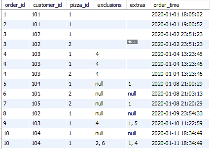  

The data quality issues observed included:
- The presence of 'null' in the exclusions and extras columns instead of NULL to indicate unavailable entries
- The customer_orders table, the exclusions & extras column contained several comma separated values.

The code for this data cleaning can be found [here](https://github.com/HannahIgboke/Pizza-runner-Business-analysis/blob/main/SQL_files/customer_orders_table_cleaning.sql).

The cleaned table looks like this:

------------------------------------------------

**runner_orders**

Each order is assigned to a runner (given by the runner_id) - however not all orders are fully completed and can be cancelled by the restaurant or the customer. The pickup_time shows the timestamp which the runner picks up the orders, The distance and duration fields are related to how far and long the runner had to travel to deliver the order to the respective customer.

|   

Data quality issues observed include:
- The pickup time, distance, and duration columns have inappropriate data types.
- The pickup time column contains 'null' string entries instead of NULL.
- The distance column contains 'null' string entries, and non-uniform entries such as 'km' and ' km' or none.
- The values of the duration column are  inconsistent. Some values have 'mins', 'minutes' , 'minute', 'null 'or nothing.
- The cancellation column contains 'null' entries

The code for this data cleaning can be found [here](https://github.com/HannahIgboke/Pizza-runner-Business-analysis/blob/main/SQL_files/runners_orders_table_cleaning.sql)

----------------------------------------------------------------------------------------------------------------------------------------------------------------------------

**runners**
The runners table shows the registration_date for each new runner. No data quality issues were discovered hence it is fit for analysis.

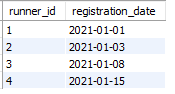    

----------------------------------------------------------------------------------------------------------------------------------------------------------------------------

**pizza_names**

At the moment, Pizza Runner only has 2 pizzas available: Meat Lovers and Vegetarian! No data quality issues discovered.

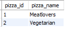 

----------------------------------------------------------------------------------------------------------------------------------------------------------------------------

**pizza_recipes**

Each pizza_id has a standard set of toppings which are used as part of the pizza recipe. No data quality issues discovered!

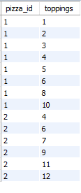

----------------------------------------------------------------------------------------------------------------------------------------------------------------------------

**pizza_toppings**

Contains all of the topping_name values with their corresponding topping_id value. No data quality issues were discovered.

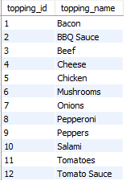  

----------------------------------------------------------------------------------------------------------------------------------------------------------------------------

## Data Analysis

The data analysis stage is a critical component in enabling Pizza Runner's quest for operational excellence. An analysis of various sectors of Pizza Runner would provide vital insights to enhance the decision-making process, better direct their runners, boost sales, and improve customer satisfaction.

### Pizza metrics

All codes for this analysis can be found here. Pizza runner has posed the following business questions:

**1. How many pizzas were ordered?**
Pizza runner is interested to know just how many orders they have received. This is solved by COUNTing the number of instances where customers made an order as given by the customer_orders table.

*Solution:*

Based on the data provided, Pizza runner has received a total of 14 pizza orders from its customers.

**2. How many unique customer orders were made?**

In Pizza runner, every order made is given an order_id which means that in one order more than one pizza can be ordered. Therefore Pizza runner wants to find out how many distinct orders were made. 

*Solution:*
From the customer_orders table, it was discovered that 10 unique/distinct orders have been made

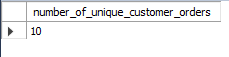

**3. How many successful orders were delivered by each runner?**

A successful order is one where neither the restaurant nor the customer cancel the order. Pizza Runner likes to ensure that all orders are delivered successfully, so it is curious to know how many orders have been successfully delivered by each runner.
P.S. Due to data privacy issues, each runner has been given an anonymized runner_id.

*Solution:*

The answer to this question was reached by COUNTing the number of orders handled by each runner. The results were grouped by runner_id.

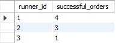

From the runner_orders table, a total of 10 orders were assigned to riders. Two of the orders were cancelled, one by the restaurant and the other by the customer. Runner 1 was seen to make the most deliveries, and runner 3 the least.

**4. How many of each type of pizza was delivered?**

For now, Pizza Runner makes and delivers two types of pizzas: Meatlovers (pizza_id 1) pizza and Vegetarian (pizza_id 2) pizza.

*Solution:*

To answer this I JOINed two tables: the customer_orders and the runner_orders tables, filtered for instances where the order was not cancelled (i.e cancellation IS NULL) and then grouped the results by the pizza_id.

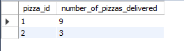

Meatlovers Pizza received nine orders in all, and Vegetarian 3.

**5. How many Vegetarians and Meatlovers were ordered by each customer?**

Now that Pizza Runner knows how many of each type of pizza was delivered, it further wants to know how many of each type of pizza was ordered by each customer, regardless of whether the order was cancelled. Like in the case of the runners, customer identities are protected through an anonymized customer_id.

*Solution:*

The pizza_id was used to connect the customer_orders and pizza_names tables using an INNER JOIN. The results were then GROUPed first by the customer_id, followed by the name of the pizza_name.

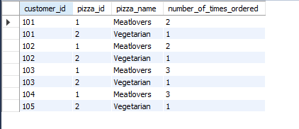

In summary, we see that all the customers ordered more Meatlovers pizza except customer 105. Customer 105 appeared once in the customer_orders table because that was their first time placing their order. So 105’s first order was Vegetarian pizza.

**6. What was the maximum number of pizzas delivered in a single order?**

As earlier mentioned, a pizza order is seen as ‘delivered’ when neither the customer nor the restaurant cancel it. Pizza runner has asked to know what the maximum number of pizzas ordered were delivered in a single order. A'single order’ is indicated by the pickup time when the runners picked up the order from the restaurant.

*Solution:*

In order to answer this I used an INNER JOIN to retrieve data from both tables and eliminate unrelated data thereby returning only rows where there was a match in both tables being joined.

The results show that the maximum number of pizzas delivered in a single order is 3.

**7. For each customer, how many delivered pizzas had at least one change and how many had no changes?**

Pizza Runner affords its customers the opportunity to customize their orders. They can either exclude or add specific toppings as they deem fit. Pizza runner would like to know how many of the successful orders had at least one change and how many had no changes. A change occurs when either an extra or an exclusion is made.

*Solution:*

I used two CASE statements to solve this. The first CASE statement COUNTs the number of times where neither an exclusion or extra was made - no change. The second CASE statement searches for and COUNTs instances where either an exclusion or an extra was made. Again the results were filtered to return cases where the orders were not cancelled.

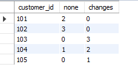

On two occasions, Customer 101's orders had no changes, while three of Customer 102’s orders had no changes. All three of 103’s orders had at least one change in them. Customer 104, who made 3 orders, made at least one change in one of them and no change in one of them. Customer 105's first order also had at least one change.

**8. How many pizzas were delivered that had both exclusions and extras?**

Based on customer preferences, they could add or remove a topping(s) from an order. With this in mind, Pizza Runner wants to find out if there were cases like this in any of the orders delivered.

*Solution:*

The method for solution follows the same pattern as the last question except that here, the CASE statement COUNTs instances where exclusions and extras were made that is, where exclusion and extras are NOT NULL.

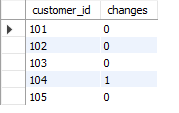

Results show that there was only one case where an exclusion and extras were made. This was made by customer 104.

**9. What was the total volume of pizzas ordered for each hour of the day?**

Next, Pizza runner wants to understand what the workload is like for each hour of the day. They would like to know what hours of the day are the busiest, where busy = more orders made during that hour.

*Solution:*

From the customer_orders table, the HOUR of the day was extracted from the order_time column while the orders made within that hour period  was COUNTed. The results were GROUPed by the hour of the day and ORDERed from the highest to lowest orders made.

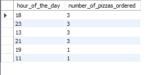

For more context, the 11th hour, for example, indicates the pizzas ordered between 11 a.m. to 12 p.m.The 13th (1pm), 18th (6pm), 21st (9pm), and 23rd (111pm) hour periods saw high volumes of pizza orders. From this, we see that customers are seen ordering pizza during lunch breaks, in the evenings as they head home, and as late-night snacks.

**10. What was the volume of orders for each day of the week?**

What day of the week is the busiest at Pizza Runner? They would like to know how the volume of pizzas ordered varies each day of the week.

*Solution:*

The order_time column is in datetime format. In order to obtain the required values, I used the DAYOFWEEK and DAYNAME functions to extract the day of the week and day name from the order_time column in the customer_orders table.

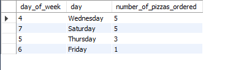

For this analysis, Sunday is taken as day 1, Monday, day 2, etc. The midweek (Wednesday) and the end of the week (Saturday) saw the highest number of pizzas ordered. Friday had the fewest pizzas ordered.

**Recommendations**

Following the insights I was able to garner from the data provided, I would recommend that Pizza Runner implement the following to optimize operations and drive sales:

*Enhanced customer and business data collection:*

- Collect and store additional customer data, including gender, location, marital status, age, and demographics.
- Further utilize this data for predictive analysis and to build recommendation systems aimed at creating personalized experiences and discounts to meet individual customer needs effectively.
- More data on Pizza Runner’s operations should be collected in order to monitor sales data, revenue, expenditures, and market trends to make informed decisions, reducing the risk of costly mistakes or misaligned strategies.

*Peak Hour Marketing and Customized Menus:*

- Implement targeted marketing campaigns during peak hours (11th, 18th, 21st, and 23rd hours) to promote pizza orders.
- Offer special discounts, promotions, or bundle deals during these times to attract more customers.
- Create customized menus tailored to different time periods, like quick lunch options during the 11th hour and family-sized pizzas during the evening and late-night hours.

*Efficient Operations:*

- Adjust staffing schedules to accommodate peak ordering times.
- Ensure there are enough delivery runners and kitchen staff to maintain quick delivery times during high-demand periods.
- Implement a robust order tracking system with notifications to enhance customer satisfaction, especially during busy hours.

*Customer Loyalty Program:*

- Introduce a customer loyalty program that rewards frequent customers.
- Offer points or discounts for repeat orders during highlighted hours to encourage customer retention.

### Runner and customer experience

### Ingredient optimization

### Pricing and ratings

### Conclusion/Limitations

