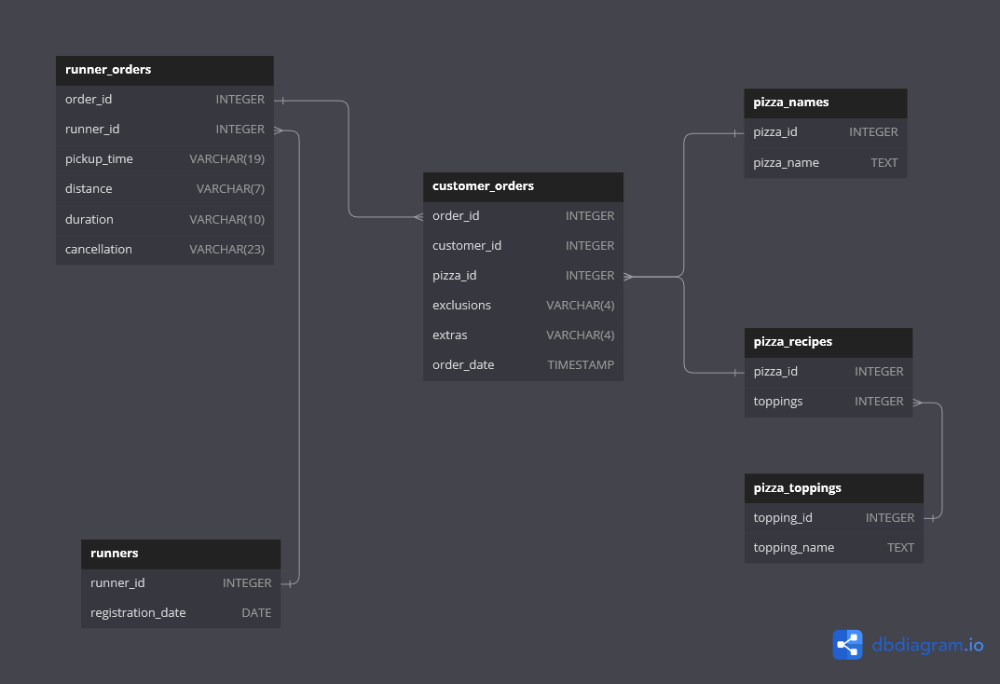

# Pizza:pizza:-runner-Business-analysis

**Aim**: Use descriptive analysis to answer business questions and make recommendations to optimize Pizza Runner's operations and drive sales.

## Table of contents

- [Introduction](https://github.com/HannahIgboke/Pizza-runner-Business-analysis#introduction)
- [Problem statement](https://github.com/HannahIgboke/Pizza-runner-Business-analysis/tree/main#problem-statement)
- [Skills demonstrated](https://github.com/HannahIgboke/Pizza-runner-Business-analysis/edit/main/README.md#skills-demonstrated)
- [Data wrangling](https://github.com/HannahIgboke/Pizza-runner-Business-analysis/edit/main/README.md#data-wrangling)
  - [Data collection and database creation](https://github.com/HannahIgboke/Pizza-runner-Business-analysis/edit/main/README.md#data-collection-and-database-creation)
  - [Exploratory data analysis](https://github.com/HannahIgboke/Pizza-runner-Business-analysis/edit/main/README.md#exploratory-data-analysis)
  - [Data cleaning](https://github.com/HannahIgboke/Pizza-runner-Business-analysis/edit/main/README.md#data-cleaning)
- [Data analysis]()
  - [Pizza metrics](https://github.com/HannahIgboke/Pizza-runner-Business-analysis/edit/main/README.md#pizza-metrics)
  - [Runner and customer experience](https://github.com/HannahIgboke/Pizza-runner-Business-analysis/edit/main/README.md#runner-and-customer-experience)
  - [Ingredient optimization](https://github.com/HannahIgboke/Pizza-runner-Business-analysis/edit/main/README.md#ingredient-optimization)
  - [Pricing and ratings](https://github.com/HannahIgboke/Pizza-runner-Business-analysis/edit/main/README.md#pricing-and-ratings)
- [Conclusion and Limitations](https://github.com/HannahIgboke/Pizza-runner-Business-analysis/edit/main/README.md#conclusionlimitations)

## Introduction

Danny was browsing Instagram when he saw an ad for 80s retro styling and pizza. He loved the idea, but he knew he needed to do more than just sell pizza to get seed funding for his new business. So, he decided to Uberize it and create Pizza Runner, a pizza delivery service.
Danny started by recruiting runners to deliver pizza from his house, which served as Pizza Runner Headquarters. He also maxed out his credit card to pay freelance developers to create a mobile app for customers to place orders. Pizza runner has come a long way and now needs to put its data collected into good use **better direct its runners, optimize operations and improve sales**.

P.S:This is challenge 2 — [Pizza runner](https://8weeksqlchallenge.com/case-study-2/) of the [8 Weeks SQL Challenge](https://8weeksqlchallenge.com/getting-started/) by Danny Ma.

## Problem statement
In order for Pizza Runner to **better direct its runners, optimize operations and improve sales**, it requires insights and recommendations on the following focus areas:
- Pizza Metrics
- Runner and Customer Experience
- Ingredient Optimisation
- Pricing and Ratings

## Skills demonstrated

- Data wrangling in MySQL
- Aggregate functions
- SQL table joins
- Common table expressions (CTE's)
- Project documentation

## Data wrangling

There are three processes in Data Wrangling: collection, exploratory data analysis, and cleaning. These steps are implored to make our data fit for analysis.

### Data collection and database creation
Owing to the fact that Danny had a few years of experience as a data scientist he knew that data collection was going to be critical for his business’ growth. He has provided a subset the Pizza runner data for the purpose of this analysis. 
I used MySQL Workbench to create a [database](SQL_files/Database_creation.sql) for Pizza runner and to carry out intensive analysis. Below is the Entity Relationship Diagram (ERD) showing the relationships between the tables in the database called pizza_runner.

### Exploratory data analysis

It is best practice to perform Exploratory data analysis before cleaning to investigate the data, identify loopholes and further understand the relationship between tables.

On inspection, I observed some data quality issues in the customer_orders table, runer_orders table nincluding: inconsistencies in data types, and formatting.

### Data cleaning

This stage is specially reserved for cleaning the data and addressing every data quality issue observed in the EDA stage.
For the affected tables, the following issues were identified and treated:

**customer_orders**

Customer pizza orders are captured in the customer_orders table with one row for each individual pizza that is part of the order. Exclusions and extras refers to the toppings the customer excluded or added to their order. The results from the EDA is shown below

    

The data quality issues observed included:
- The presence of 'null' in the exclusions and extras columns instead of NULL to indicate unavailable entries
- The customer_orders table, the exclusions & extras column contained several comma separated values.

The code for this data cleaning can be found [here](https://github.com/HannahIgboke/Pizza-runner-Business-analysis/blob/main/SQL_files/customer_orders_table_cleaning.sql).

The cleaned table looks like this:

    

After taking care of the comma seperated values, the tables looked like this:

    

------------------------------------------------

**runner_orders**

Each order is assigned to a runner (given by the runner_id) - however not all orders are fully completed and can be cancelled by the restaurant or the customer. The pickup_time shows the timestamp which the runner picks up the orders, The distance and duration fields are related to how far and long the runner had to travel to deliver the order to the respective customer.

    

Data quality issues observed include:
- The pickup time, distance, and duration columns have inappropriate data types.
- The pickup time column contains 'null' string entries instead of NULL.
- The distance column contains 'null' string entries, and non-uniform entries such as 'km' and ' km' or none.
- The values of the duration column are  inconsistent. Some values have 'mins', 'minutes' , 'minute', 'null 'or nothing.
- The cancellation column contains 'null' entries

The code for this data cleaning can be found [here](https://github.com/HannahIgboke/Pizza-runner-Business-analysis/blob/main/SQL_files/runners_orders_table_cleaning.sql)

----------------------------------------------------------------------------------------------------------------------------------------------------------------------------

**runners**

The runners table shows the registration_date for each new runner. No data quality issues were discovered hence it is fit for analysis.

    

----------------------------------------------------------------------------------------------------------------------------------------------------------------------------

**pizza_names**

At the moment, Pizza Runner only has 2 pizzas available: Meat Lovers and Vegetarian! No data quality issues discovered.

    

----------------------------------------------------------------------------------------------------------------------------------------------------------------------------

**pizza_recipes**

Each pizza_id has a standard set of toppings which are used as part of the pizza recipe. No data quality issues discovered!

    

----------------------------------------------------------------------------------------------------------------------------------------------------------------------------

**pizza_toppings**

Contains all of the topping_name values with their corresponding topping_id value. No data quality issues were discovered.

    

----------------------------------------------------------------------------------------------------------------------------------------------------------------------------

## Data Analysis

The data analysis stage is a critical component in enabling Pizza Runner's quest for operational excellence. An analysis of various sectors of Pizza Runner would provide vital insights to enhance the decision-making process, better direct their runners, boost sales, and improve customer satisfaction.

### Pizza metrics

All codes for this analysis can be found [here](https://github.com/HannahIgboke/Pizza-runner-Business-analysis/blob/main/SQL_files/Pizza_metrics.sql). Pizza runner has posed the following business questions:

**1. How many pizzas were ordered?**
Pizza runner is interested to know just how many orders they have received. This is solved by COUNTing the number of instances where customers made an order as given by the customer_orders table.

*Solution:*

Based on the data provided, Pizza runner has received a total of 14 pizza orders from its customers.

    

**2. How many unique customer orders were made?**

In Pizza runner, every order made is given an order_id which means that in one order more than one pizza can be ordered. Therefore Pizza runner wants to find out how many distinct orders were made. 

*Solution:*

From the customer_orders table, it was discovered that 10 unique/distinct orders have been made

    

**3. How many successful orders were delivered by each runner?**

A successful order is one where neither the restaurant nor the customer cancel the order. Pizza Runner likes to ensure that all orders are delivered successfully, so it is curious to know how many orders have been successfully delivered by each runner.
P.S. Due to data privacy issues, each runner has been given an anonymized runner_id.

*Solution:*

The answer to this question was reached by COUNTing the number of orders handled by each runner. The results were grouped by runner_id.

    

From the runner_orders table, a total of 10 orders were assigned to riders. Two of the orders were cancelled, one by the restaurant and the other by the customer. Runner 1 was seen to make the most deliveries, and runner 3 the least.

**4. How many of each type of pizza was delivered?**

For now, Pizza Runner makes and delivers two types of pizzas: Meatlovers (pizza_id 1) pizza and Vegetarian (pizza_id 2) pizza.

*Solution:*

To answer this I JOINed two tables: the customer_orders and the runner_orders tables, filtered for instances where the order was not cancelled (i.e cancellation IS NULL) and then grouped the results by the pizza_id.

    

Meatlovers Pizza received nine orders in all, and Vegetarian 3.

**5. How many Vegetarians and Meatlovers were ordered by each customer?**

Now that Pizza Runner knows how many of each type of pizza was delivered, it further wants to know how many of each type of pizza was ordered by each customer, regardless of whether the order was cancelled. Like in the case of the runners, customer identities are protected through an anonymized customer_id.

*Solution:*

The pizza_id was used to connect the customer_orders and pizza_names tables using an INNER JOIN. The results were then GROUPed first by the customer_id, followed by the name of the pizza_name.

    

In summary, we see that all the customers ordered more Meatlovers pizza except customer 105. Customer 105 appeared once in the customer_orders table because that was their first time placing their order. So 105’s first order was Vegetarian pizza.

**6. What was the maximum number of pizzas delivered in a single order?**

As earlier mentioned, a pizza order is seen as ‘delivered’ when neither the customer nor the restaurant cancel it. Pizza runner has asked to know what the maximum number of pizzas ordered were delivered in a single order. A'single order’ is indicated by the pickup time when the runners picked up the order from the restaurant.

*Solution:*

In order to answer this I used an INNER JOIN to retrieve data from both tables and eliminate unrelated data thereby returning only rows where there was a match in both tables being joined.

    

The results show that the maximum number of pizzas delivered in a single order is 3.

**7. For each customer, how many delivered pizzas had at least one change and how many had no changes?**

Pizza Runner affords its customers the opportunity to customize their orders. They can either exclude or add specific toppings as they deem fit. Pizza runner would like to know how many of the successful orders had at least one change and how many had no changes. A change occurs when either an extra or an exclusion is made.

*Solution:*

I used two CASE statements to solve this. The first CASE statement COUNTs the number of times where neither an exclusion or extra was made - no change. The second CASE statement searches for and COUNTs instances where either an exclusion or an extra was made. Again the results were filtered to return cases where the orders were not cancelled.

    

On two occasions, Customer 101's orders had no changes, while three of Customer 102’s orders had no changes. All three of 103’s orders had at least one change in them. Customer 104, who made 3 orders, made at least one change in one of them and no change in one of them. Customer 105's first order also had at least one change.

**8. How many pizzas were delivered that had both exclusions and extras?**

Based on customer preferences, they could add and remove a topping(s) from an order. With this in mind, Pizza Runner wants to find out if there were cases like this in any of the orders delivered.

*Solution:*

The method for solution follows the same pattern as the last question except that here, the CASE statement COUNTs instances where exclusions and extras were made that is, where exclusion and extras are NOT NULL.

    

Results show that there was only one case where an exclusion and extras were made. This was made by customer 104.

**9. What was the total volume of pizzas ordered for each hour of the day?**

Next, Pizza runner wants to understand what the workload is like for each hour of the day. They would like to know what hours of the day are the busiest, where busy = more orders made during that hour.

*Solution:*

From the customer_orders table, the HOUR of the day was extracted from the order_time column while the orders made within that hour period  was COUNTed. The results were GROUPed by the hour of the day and ORDERed from the highest to lowest orders made.

    

For more context, the 11th hour, for example, indicates the pizzas ordered between 11 a.m. to 12 p.m.The 13th (1pm), 18th (6pm), 21st (9pm), and 23rd (111pm) hour periods saw high volumes of pizza orders. From this, we see that customers are seen ordering pizza during lunch breaks, in the evenings as they head home, and as late-night snacks.

**10. What was the volume of orders for each day of the week?**

What day of the week is the busiest at Pizza Runner? They would like to know how the volume of pizzas ordered varies each day of the week.

*Solution:*

The order_time column is in datetime format. In order to obtain the required values, I used the DAYOFWEEK and DAYNAME functions to extract the day of the week and day name from the order_time column in the customer_orders table.

    

For this analysis, Sunday is taken as day 1, Monday, day 2, etc. The midweek (Wednesday) and the end of the week (Saturday) saw the highest number of pizzas ordered. Friday had the fewest pizzas ordered.

**Recommendations**

Following the insights I was able to garner from the data provided, I would recommend that Pizza Runner implement the following to optimize operations and drive sales:

*Enhanced customer and business data collection:*

- Collect and store additional customer data, including gender, location, marital status, age, and demographics.
- Further utilize this data for predictive analysis and to build recommendation systems aimed at creating personalized experiences and discounts to meet individual customer needs effectively.
- More data on Pizza Runner’s operations should be collected in order to monitor sales data, revenue, expenditures, and market trends to make informed decisions, reducing the risk of costly mistakes or misaligned strategies.

*Peak Hour Marketing and Customized Menus:*

- Implement targeted marketing campaigns during peak hours (11th, 18th, 21st, and 23rd hours) to promote pizza orders.
- Offer special discounts, promotions, or bundle deals during these times to attract more customers.
- Create customized menus tailored to different time periods, like quick lunch options during the 11th hour and family-sized pizzas during the evening and late-night hours.

*Efficient Operations:*

- Adjust staffing schedules to accommodate peak ordering times.
- Ensure there are enough delivery runners and kitchen staff to maintain quick delivery times during high-demand periods.
- Implement a robust order tracking system with notifications to enhance customer satisfaction, especially during busy hours.

*Customer Loyalty Program:*

- Introduce a customer loyalty program that rewards frequent customers.
- Offer points or discounts for repeat orders during highlighted hours to encourage customer retention.

----------------------------------------------------------------------------------------------------------------------------------------------------------------------------

### Runner and customer experience

Pizza Runner wants to know about its runner and customer experience so far, so it can identify areas it isn't doing well and areas it can improve upon. 
All codes for this analysis can be found [here](https://github.com/HannahIgboke/Pizza-runner-Business-analysis/blob/main/SQL_files/Runner_and_Customer_Experience.sql)

**1. How many runners signed up for each 1 week period? (i.e. week starts 2021-01-01)**

An individual becomes a runner at Pizza Runner when they sign up and have been onboarded.

*Solution:*

To answer this, I selected the week number for each registration date, then added 2 days to the registration date using the INTERVAL keyword before calculating the week number using the WEEK function.
It is important to note the 'INTERVAL 2 DAY' part of the code. I added this to standardize the week boundaries, especially because the data doesn't align with a particular week's starting day. For example, 2021–01–01 was a Friday and hence not the start of the week (for the sake of this analysis, I picked Sunday to be the start of the week). By adding a 2-day interval, I effectively shifted the starting point of the week from Friday to Sunday.

    

In the first week of January 2021, Pizza runner signed up two runners while in the second and third weeks, one runner each signed up.

**2. What was the average time in minutes it took for each runner to arrive at the Pizza Runner HQ to pickup the order?**

Just how long, on average (i.e., the mean), did it take each runner to arrive at the HQ to pickup an order?

*Solution:*

    

On average runner two takes the most time.

**Recommendations**
- Implement a location tracking system for runners during their delivery/work hours, similar to the systems used by ride-sharing services like Uber or Bolt.
- Develop a real-time tracking system that allows Pizza Runner to monitor the location of each runner during their shifts.
- Utilize the location data to optimize delivery assignments by assigning orders to runners who are in close proximity to the delivery location, reducing delivery times.
- Implement route optimization algorithms that consider live runner locations to minimize delivery distances and increase overall delivery efficiency.
- Enhanced Customer Experience: Real-time tracking of runner locations can be shared with customers, improving transparency and providing them with estimated delivery times.

**3. Is there any relationship between the number of pizzas and how long the order takes to prepare?**

Pizza Runner wants to know how long an order takes to be prepared based on the number of pizzas ordered at a time.

*Solution:*

    

When Pizza Runner receives one order, it takes them about 12 minutes on average, 18 minutes for two, and 29 minutes for three. Ordinarily, you would expect that preparing two pizzas would take twice as long as preparing one pizza. In this case, Pizza Runner is efficient enough to cut down on the time taken to prepare more than one pizza. But this efficiency can be improved upon.

**Recommendations**

- Automated Pizza Assembly Line: Pizza Runner should invest in an automated pizza assembly line that can prepare multiple pizzas simultaneously, reducing preparation time for multiple orders. This automation ensures consistent quality and speeds up the pizza-making process, resulting in quicker order fulfillment.
- Kitchen Optimization: Reconfigure the kitchen layout to accommodate automated equipment while maintaining a smooth workflow and safety.
- Employee Training: Train the kitchen staff to operate and maintain the automation equipment effectively, thereby ensuring a seamless integration into Pizza Runner’s daily operations.

**4. What was the average distance traveled for each customer?**

On average, how far (distance) is a customer’s place from Pizza Runner’s HQ?

*Solution:*

Customer 105's location is the farthest from the entire customer base. On average, runners have to travel 25 kilometers to deliver their order. Customer 104’s location is the closest to the HQ, with an average distance of 10km.

    

**Recommendations**

- Geographic Customer Targeting: Identify and target potential customers in the vicinity of the headquarters through localized marketing efforts to increase the number of orders from nearby areas.
- Promotions for Nearby Customers: Offer special promotions or discounts to incentivize orders from customers near the HQ, making it more attractive for them to choose Pizza Runner.
- Self-Pickup Feature: Develop and implement a self-pickup feature on the mobile app and website, allowing customers to choose to collect their orders in person.
- User-Friendly Interface: Ensure the self-pickup feature is user-friendly and intuitive for customers to select as their preference during the ordering process.
- Communication and Marketing: Communicate the benefits of self-pickup, such as reduced delivery fees and quicker access to their orders, to customers through marketing campaigns.

**5. What was the difference between the longest and shortest delivery times for all orders?**

In general, Pizza runner would like to know the longest and shortest delivery times for their customer base, as well as the differences between them.

*Solution:*

    

The longest time spent on a delivery was 40 minutes, and the shortest was 10 minutes which brings the difference to 30 minutes.

**6. What was the average speed for each runner for each delivery?**

*Solution:*

    

The results above show the average speed of each runner for each delivery handled.

**7. What is the successful delivery percentage for each runner?**

The successful delivery percentage for each runner refers to how many percent of deliveries assigned to each runner were successful, i.e., the orders were not cancelled by either the restaurant or the customer.

*Solution:*

The successful delivery percentage for each runner is based on the number of orders that were assigned to each of them.

    

Runner 1 achieved a perfect delivery rate, as they successfully completed all four assigned deliveries with no cancellations. Runner 2, on the other hand, was assigned four deliveries, with one cancellation by the customer, resulting in a 75% successful delivery rate. Runner 3 had the fewest assignments, managing two deliveries, but one of them was canceled by the restaurant, leading to an overall delivery success rate of 50%.

**Other recommendations**

- A weekly feedback and review form should be rolled out and enabled on the mobile app or website or sent directly to customers' emails in order to gather more specific data to generate insights on customer satisfaction.
- Data should be collected on reasons for order cancellations to enable the pizza runner to identify present and potential loopholes.

--------------------------------------------------------------------------------------------------------------------------------------------------------------------------

### Ingredient optimization

Here, Pizza Runner is more concerned with basic knowledge of the common extras and exclusions in their pizza orders, as well as having handy summary tables they can quickly look at to understand the nature of customers' orders.

**1. What are the standard ingredients for each pizza?**

Pizza runner wants to have an overview of the ingredients that can be used to prepare each pizza.

*Solution:*

    

The results show all the ingredients used to prepare the Meatlovers and Vegetarian pizza.

**2. What was the most commonly added extra?**

An ‘extra’ in Pizza Runner’s orders signifies a topping or ingredient customers can request to be added to their order.

*Solution:*

To answer this question, I created a TEMPORARY table called customer_orders_cleaned. You can find the link for the code in my GitHub Repository. I created a temporary table as seen below so I could simplify complex queries rather than constructing intricate queries with numerous subqueries or joins.

    

Output:

    

The most common extra is Bacon, and the least common chicken.

**3. What was the most common exclusion?**

Exclusions refer to toppings or ingredients requested to be excluded from their orders.

*Solution:*

    

The most common exclusion is Cheese. It was excluded 5 times from the orders.

**4. Generate an order item for each record in the customers_orders table in the format of one of the following:**
Meat Lovers
Meat Lovers - Exclude Beef
Meat Lovers - Extra Bacon
Meat Lovers - Exclude Cheese, Bacon - Extra Mushroom, Peppers

Pizza runner simply wants a table summarizing the order item for each record/order made to Pizza runner.

*Solution:*

    

The summary table above shows the order item for each record/order made to Pizza runner.

**5. Generate an alphabetically ordered comma separated ingredient list for each pizza order from the customer_orders table and add a 2x in front of any relevant ingredients. For example: "Meat Lovers: 2xBacon, Beef, ... , Salami"**

Pizza runner does not want to keep going back and forth between tables trying to match customer's orders to the pizza types and names hence they have requested this table.

*Solution:*

    

The table shows an alphabetically ordered comma separated ingredient list for each pizza order from the customer_orders table.

---------------------------------------------------------------------------------------------------------------------------------------------------------------------

### Pricing and ratings

As a data analyst for Pizza runner I have been asked to create several tables and provide answers to some questions as shown below. These tables are required to give Pizza Runner a view of how different pricing and fees affects the overall cost and revenue. They are also interested in creating a rating system for their runners and adding a new pizza option to their menu. Check [here](https://github.com/HannahIgboke/Pizza-runner-Business-analysis/blob/main/SQL_files/Pricing_and_ratings.sql) for all the codes used to solve the questions below.

**1. If a Meat Lovers pizza costs $12 and Vegetarian costs $10 and there were no charges for changes - how much money has Pizza Runner made so far if there are no delivery fees?**

According to Pizza Runner's menu, Meatlovers cost $12 and Vegetarian, $10. Pizza Runner wants to know what its revenue would be if it didn't charge for changes (extras or exclusions) or deliveries.

*Solution:*

    

Meatlovers were ordered nine times and made $108 for Pizza Runner, while Vegetarian ordered three times and made $30. Without charges for changes or deliveries, they made a total of $138.

**2. What if there was an additional $1 charge for any pizza extras? Add cheese is $1 extra.**

Now, they need to know what their revenue would be with a $1 charge for any pizza extra.

*Solution:*

    

Meatlovers made the highest revenue since it was ordered the most, and Vegetarian the least. Totally, they'll make $167.

**3. The Pizza Runner team now wants to add an additional ratings system that allows customers to rate their runner, how would you design an additional table for this new dataset - generate a schema for this new table and insert your own data for ratings for each successful customer order between 1 to 5.**

Here, Pizza Runner required that I create a database (or schema) for runner ratings in order to allow customers rate their runner.

*Solution:*
There are several ways to create this additional table for this dataset. For my analysis, I used the RAND() function in SQL to create a randomized rating system. This code can be further modified when data for customer ratings of runners becomes available.

    

The table above shows a newly generated table containing randomly assigned ratings for runners.

**4. Using your newly generated table - can you join all of the information together to form a table which has the following information for successful deliveries?**
  - customer_id
  - order_id
  - runner_id
  - rating
  - order_time
  - pickup_time
  - Time between order and pickup
  - Delivery duration
  - Average speed
  - Total number of pizzas

For simplicity and ease in Pizza Runner's operations they required a table that would present the above information at a glance for each successful deliveries. They also wanted the table to be in such a way that it can be updated with the availability of more data.

*Solution:*

To achieve the data I JOINed the three relevant tables: customer_orders, runner_orders, and runner_ratings, and filtered the results for only cases where the deliveries were succesful. The GROUP BY statement helps to organize and group the results by the values of interest.

    

The table above provides Pizza Runner with an overview of necessary information for every successful delivery.

**5. If a Meat Lovers pizza was $12 and Vegetarian $10 fixed prices with no cost for extras and each runner is paid $0.30 per kilometer traveled - how much money does Pizza Runner have left over after these deliveries?**

Pizza Runner is testing different scenarios and how each scenario affects their revenue and cost. In this case, they would like to know how much would be left from their total revenue of $138 if they paid each runner $0.30 per km traveled.

*Solution:*

    

As seen earlier in the analysis, if Pizza Runner charged nothing for changes, they would make a total of $138 for all successful orders. In the event they pay each runner $0.30 per km traveled, they would end up with a total of $49.80 after paying runners. They would have spent $62.70 to deliver Meatlovers and $25.50 for Vegetarian.

**6. If Danny wants to expand his range of pizzas - how would this impact the existing data design? Write an INSERT statement to demonstrate what would happen if a new Supreme pizza with all the toppings was added to the Pizza Runner menu?**

This indicates that Danny, the owner of Pizza Runner, is interested in adding new pizza options to his menu, and he has also asked how this new addition would impact the existing data design.

*Solution:*

Before I began my analysis, one of the first things I did was create a database for Pizza Runner's data. Since the database was well designed, adding a new pizza category was a relatively straightforward process without any significant disruption.
I added this new menu option to the pizza_names and pizza_recipes tables using the INSERT INTO statement. After addition, the updated menu can be seen below:

    

### Conclusion/Limitations

This project was truly enjoyable for me especially because as it significantly expanded my SQL skills and vocabulary and think critically about problem-solving and the most efficient approaches to solutions. CTE’s are now my next favorite thing after porridge beans 😄. However, while working on this project, I faced a significant challenge related to the data provided. The issue primarily revolved around the limited size of the sample data, which did not accurately reflect the entire dataset and, as a result, introduced the potential for bias.

